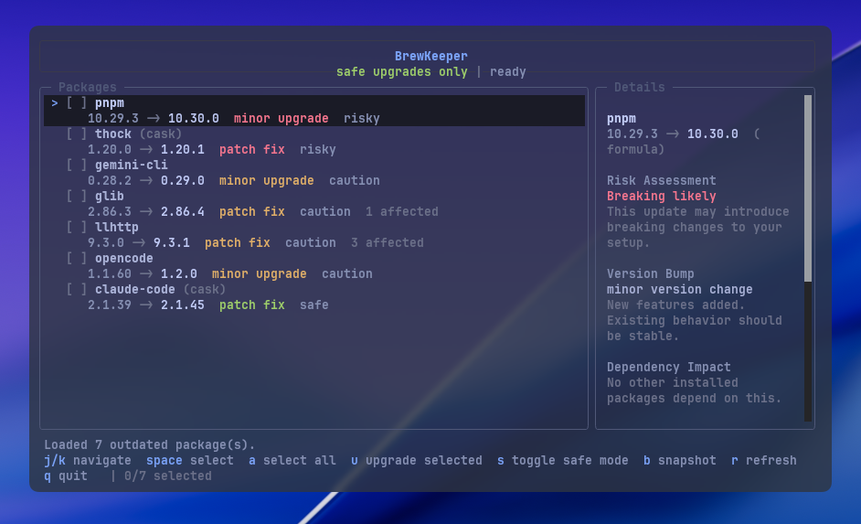

# brewkeeper

[](https://github.com/Pallepadehat/brewkeeper/actions/workflows/ci.yml)

`brewkeeper` is a polished terminal UI for Homebrew upgrades, focused on safer decisions and fast review.



It highlights:

- major/minor/patch upgrade type
- dependency impact (`brew uses`)
- risk signals and caveats
- formula + cask support
- safe-upgrades-only mode
- snapshot/rollback support (Brewfile-based)

## Install

### Homebrew (recommended)

```bash
brew tap Pallepadehat/brewkeeper
brew install brewkeeper
```

### From source

```bash
bun install
bun run build
./dist/brewkeeper
```

## Usage

```bash
brewkeeper            # launch the TUI
brewkeeper --version  # print version
```

| Key       | Action                |
| --------- | --------------------- |
| `j` / `k` | Navigate packages     |
| `Space`   | Toggle selection      |
| `a`       | Select / deselect all |
| `f`       | Search Homebrew repos |
| `i`       | Install selected search result (inside repo search) |
| `s`       | Toggle safe-mode      |
| `u`       | Upgrade selected      |
| `b`       | Create named snapshot |
| `v`       | Open snapshot list    |
| `R`       | Open snapshot list    |
| `?`       | Show keyboard help    |
| `r`       | Refresh               |
| `q`       | Quit                  |

## Development

- Runtime: [Bun](https://bun.sh) ≥ 1.2
- UI framework: OpenTUI + React
- TypeScript strict mode enabled

```bash
bun install
bun dev
```

## Build

```bash
bun run typecheck
bun run build
```

This produces a standalone binary at `dist/brewkeeper`.

## Contributing

Contributions are welcome. Please read:

- [CONTRIBUTING.md](CONTRIBUTING.md)
- [SECURITY.md](SECURITY.md)

## License

MIT — see [LICENSE](LICENSE).
